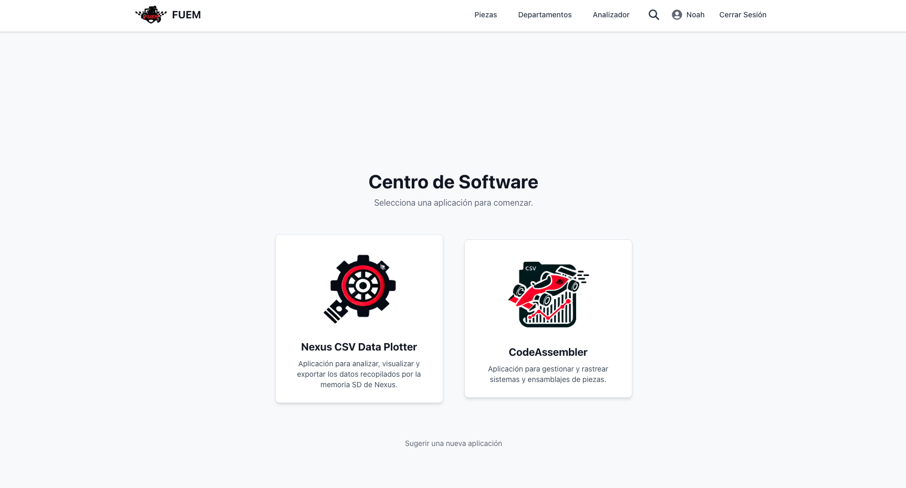
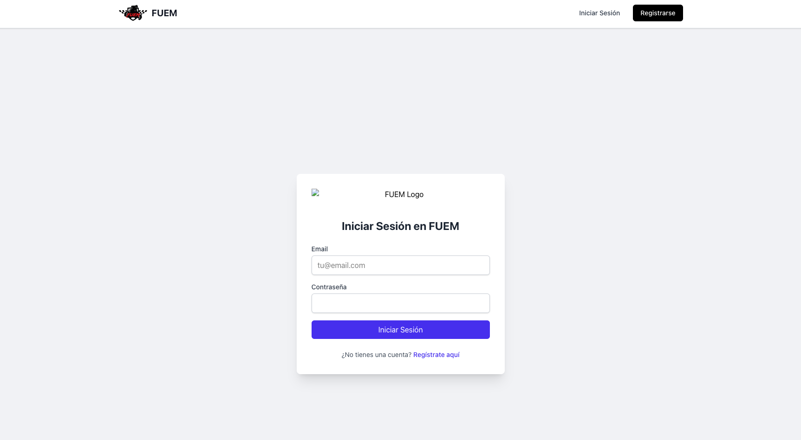
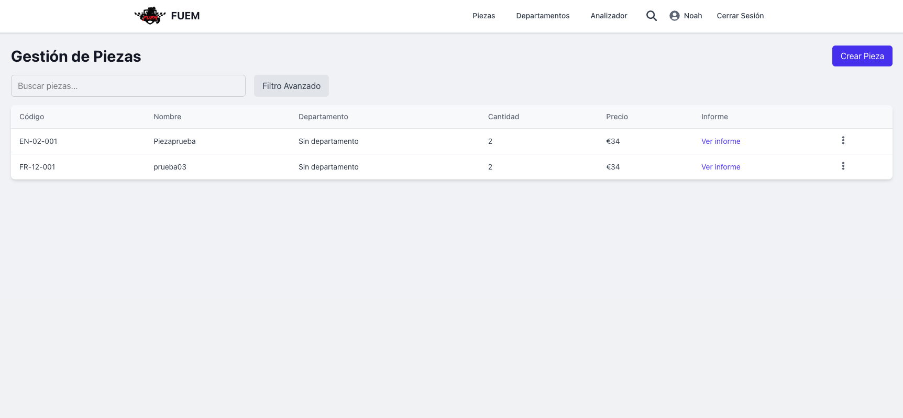
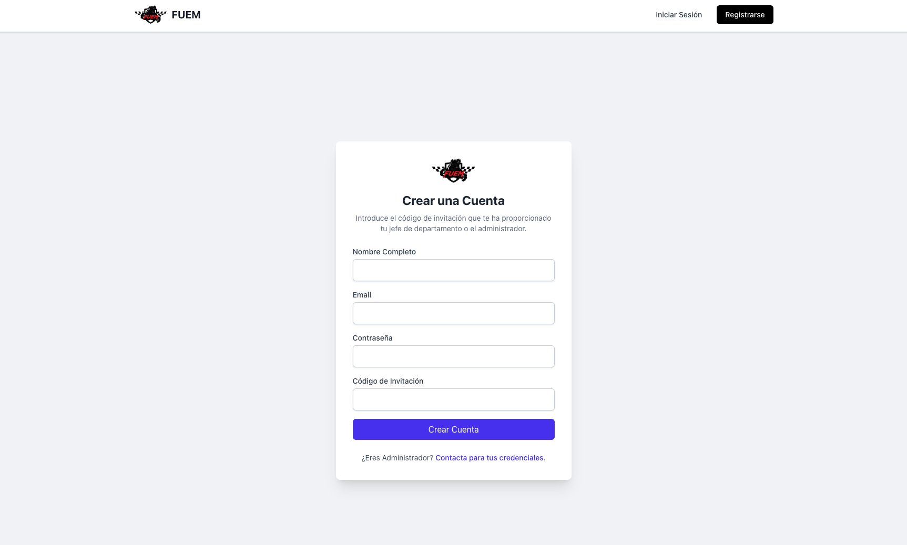
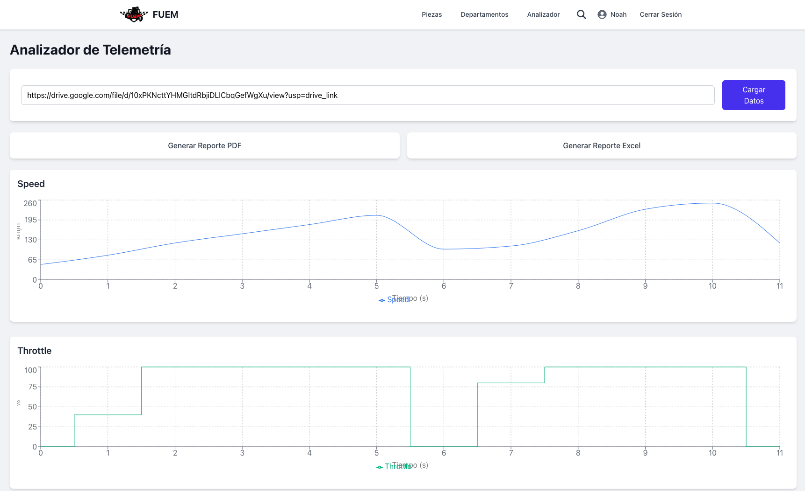

# 🏁 Sistema de Inventario para FUEM Racing (Fuemappa_v1)

Un sistema de gestión de inventario robusto y seguro, diseñado para optimizar las operaciones del equipo de competición FUEM Racing.

[](https://fuemappa-frontend.vercel.app)
[](https://fuemappa-backend.vercel.app/api)

**Visita la aplicación en vivo:** **[fuemappa-frontend.vercel.app](https://fuemappa-frontend.vercel.app)**

---

### Vista Previa de la Aplicación



## 📜 Descripción del Proyecto

**Fuemappa_v1** es una solución full-stack que aborda la necesidad de un control de inventario preciso y accesible para un equipo de motorsport. La plataforma permite a los miembros del equipo gestionar piezas, consultar existencias y analizar datos, todo ello protegido por un sistema de roles y permisos que garantiza que cada usuario solo acceda a la información que le corresponde.

## ✨ Características Principales

-   🔐 **Autenticación Segura:** Login y registro con tokens JWT.
-   👤 **Control de Acceso por Roles (RBAC):** `admin`, `jefe_departamento` e `integrante_departamento` con permisos diferenciados.
-   🔩 **Gestión de Inventario (CRUD):** Administración completa de piezas, incluyendo búsqueda y filtrado.
-   🏢 **Gestión de Departamentos:** Creación y administración de los diferentes departamentos del equipo.
-   📊 **Análisis de Datos:** Procesamiento de archivos `.csv` desde Google Drive para la visualización de datos.

## 💻 Stack Tecnológico

| Área      | Tecnología                                                                                                                              |
| :-------- | :-------------------------------------------------------------------------------------------------------------------------------------- |
| **Frontend**  | `React 19` `TypeScript` `Vite` `Zustand` `React Router` `Tailwind CSS` `Axios`                                                           |
| **Backend**   | `Node.js` `Express.js` `JWT` `bcryptjs`                                                                                               |
| **Base de Datos** | `Supabase` (PostgreSQL)                                                                                                                  |
| **Despliegue**  | `Vercel` (con dos proyectos independientes apuntando a un monorepo)                                                                      |

## 🖼️ Galería de Capturas de Pantalla

<table>
  <tr>
    <td align="center"><strong>Página de Login</strong></td>
    <td align="center"><strong>Dashboard Principal</strong></td>
  </tr>
  <tr>
    <td></td>
    <td></td>
  </tr>
    <tr>
    <td align="center"><strong>Formulario de Creación</strong></td>
    <td align="center"><strong>Análisis de Datos</strong></td>
  </tr>
  <tr>
    <td></td>
    <td></td>
  </tr>
</table>

## 🚀 Cómo Ejecutarlo Localmente

1.  **Clonar el repositorio:**
    ```bash
    git clone https://github.com/jamesyul/fuemappa_v1.git
    cd fuemappa_v1
    ```
2.  **Configurar variables de entorno:**
    *   Crea `backend/.env` (ver [ejemplo](#-despliegue-en-vercel)).
    *   Crea `frontend/.env.local` con `VITE_API_URL=http://localhost:5000`.

3.  **Instalar dependencias:**
    ```bash
    npm run install-all
    ```
4.  **Iniciar los servidores de desarrollo:**
    ```bash
    npm run dev
    ```

## ☁️ Arquitectura de Despliegue

Este proyecto está desplegado en Vercel utilizando una estrategia de **dos proyectos independientes que apuntan al mismo monorepo**, garantizando el aislamiento y la escalabilidad de cada parte:

-   **Proyecto Frontend (`fuemappa-frontend`):** Se despliega desde el directorio `/frontend` y se configura como un sitio estático de Vite.
-   **Proyecto Backend (`fuemappa-backend`):** Se despliega desde el directorio `/backend` y se configura como una función serverless de Node.js.

Esta arquitectura permite que ambos servicios se desarrollen en un único repositorio pero se desplieguen y escalen de forma independiente.

---
